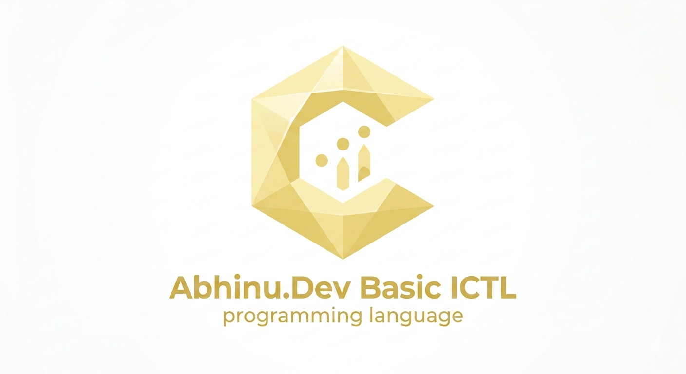

<h1 align="center" style="font-family: Comic Sans Ms; color:lightyellow">Abhinu.Dev Basic ICTL</h1>
<h1 align="center">
  <a href="https://github.com/indiancoder3/abhinu-dev_basic-ictl" target="_blank"></a>
</h1>
<p align="center"><b>A basic programming language made for making the learning journey easy! Contributions are welcome!</b></p>

<p align="center">
    <a href="https://www.python.org">Python (for building the language interpreter)</a> |
    <a href="https://indiancoder3.github.io">IndianCoder3</a> |
    <a href="#command-reference">Command Reference</a> |
    <a href="#building-story">Build Story</a>
</p>

> [!CAUTION]
> This programming language is **still in development**.
> Some features (such as `Math.Eval()`) internally use Python's `eval()`,
> which can **execute arbitrary code**. **Use with caution.**

---

## Table of Contents

- [About](#about)
- [Features](#features)
- [Quick Start](#quick-start)
- [Installation](#installation)
- [Language Basics](#language-basics)
- [Command Reference](#command-reference)
- [VS Code Extension](#vs-code-extension)
- [Examples](#examples)
- [Building from Source](#building-from-source)
- [Building Story (Lore)](#building-story)
- [Contributing](#contributing)
- [License](#license)

---

## About

**Abhinu.Dev Basic ICTL** is a beginner-friendly programming language designed to make the learning journey easy and enjoyable. Whether you're just starting out or teaching others to code, ICTL provides a clean, intuitive syntax that focuses on core programming concepts like variables, loops, conditionals, and basic mathematics.

The language is built on Python and runs as an interpreter, making it easy to execute `.ictl` files directly or use the interactive shell for learning.

### Why ICTL?

- **Simple Syntax**: Clear, readable code that's easy to understand
- **Beginner-Friendly**: Designed specifically for learning programming fundamentals
- **Quick Feedback**: Run code immediately via CLI or interactive mode
- **Educational**: Perfect for teaching programming concepts
- **Active Development**: Regular updates and improvements
- **Community**: Contributions and feedback are welcome!

---

## Features

✨ **Core Language Features:**
- **Variables**: Simple variable declaration and assignment
- **Data Types**: Strings, integers, floats, and booleans
- **Terminal I/O**: Easy input/output operations with styling options
- **Mathematics**: Arithmetic evaluation and numeric comparisons
- **Control Flow**: If/else conditionals with boolean logic
- **Loops**: Counted loops and infinite loops with break/continue support
- **String Operations**: Concatenation and variable interpolation
- **Error Handling**: Clear error messages with line numbers and suggestions

🛠️ **Developer Tools:**
- **Interactive Shell**: Drop into shell mode for immediate code execution
- **File Execution**: Run `.ictl` script files from command line
- **Syntax Highlighting**: VS Code extension with full language support
- **Code Snippets**: Quick insertion of common patterns
- **Comprehensive Documentation**: Command reference and examples

---

## Quick Start

### 1. Create a Simple Program

Create a file named `hello.ictl`:

```ictl
Program.Main {
    Terminal.Echo("Hello, World!")
}
```

### 2. Run It

**If you installed from Release (Easiest):**
```bash
ictl hello.ictl
# or if using standalone
ICTL-v1.0s.exe hello.ictl
```

**If you're developing from source:**
```bash
python main.py hello.ictl
```

### 3. Output

```
Hello, World!
```

### Try Interactive Mode

```bash
# From release
ictl

# Or from source
python main.py
```

This drops you into an interactive shell where you can execute ICTL commands line by line.

---

## Installation

Choose one of the two installation paths below:

### 🚀 Path 1: Recommended - Use Pre-built Release

The easiest way to get started! Each release includes:
- **Nuitka/PyInstaller Standalone** - Portable executable, no Python required
- **Inno Setup Installer** - System-wide installation for Windows
- **VSIX Extension** - VS Code language support (alongside the main interpreter, of course!)

#### Download from Releases

1. Go to [GitHub Releases](https://github.com/indiancoder3/abhinu-dev_basic-ictl/releases)
2. Download the latest release files for your platform

#### Option A: Standalone Executable (Easiest - because of constant updates)

```bash
# Download ICTL.exe (or your version)
ICTL.exe your_program.ictl
```

No Python installation required!

#### Option B: System-wide Installation (Windows)

1. Download the Inno Setup installer (e.g., `ICTL-v1.0s-installer.exe`)
2. Run the installer and follow the prompts
3. Add ICTL to your system PATH during installation (will be added automatically, cross check)
4. Use `ictl` from any command prompt:

```bash
ictl your_program.ictl
```

#### Option C: Install VS Code Extension

1. Download the `.vsix` file from the release
2. In VS Code, press `Ctrl+Shift+P` and run `Extensions: Install from VSIX...`
3. Select the downloaded VSIX file

---

### 💻 Path 2: Development - From Source Code

For developers who want to modify or contribute to the language.

#### Prerequisites

- Python 3.7 or higher
- `pip` (Python package installer)
- Nuitka installed (PyInstaller can be used too, but it's slow)
- Windows, macOS, or Linux

#### Installation Steps

1. **Clone the Repository**

```bash
git clone https://github.com/indiancoder3/abhinu-dev_basic-ictl.git
cd abhinu-dev_basic-ictl
```

2. **Navigate to ICTL Directory**

```bash
cd ictl-v1.1.0 # This may differ from the latest version, use that.
```

3. **Run Programs**

```bash
# Execute a file
python main.py your_program.ictl

# Or use interactive mode
python main.py
```

4. **Install VS Code Extension (optional)**

See [VS Code Extension](#vs-code-extension) section for setup instructions.

---

## Language Basics

### Variables

Variables store data that you can use throughout your program.

**Declaring a Variable:**
```ictl
Variables.New("MyVariable")  # Make sure, quotes here, and no spaces!
```

> Some parts of the documentation have missed quotes, so please understand there should be quotes. Although due to a bug, it works even without quotes, it will be patched in a future update.

**Assigning a Value:**
```ictl
Variables.MyVariable = "Hello"
Variables.Counter = 42
Variables.Pi = 3.14
```

**Using Variables:**
```ictl
Program.Main {
    Variables.New("Name")
    Variables.Name = "Alice"
    Terminal.Echo("Hello, " + Variables.Name)
}
```

### String Operations

Strings are enclosed in double quotes and can be concatenated with `+`:

```ictl
Program.Main {
    Variables.New(FirstName)
    Variables.New(LastName)
    
    Variables.FirstName = "John"
    Variables.LastName = "Doe"
    
    Terminal.Echo(Variables.FirstName + " " + Variables.LastName)
}
```

For those who are thinking that using `+` directly can add too, try `2+2` directly. It will return `22`, as Math is suppposed to be evaluated via `Math.Eval`

### Terminal I/O

**Output (Echo):**
```ictl
Terminal.Echo("This is printed to the screen")
Terminal.Echo(Variables.Counter)
```

**Input (Ask):**
```ictl
Program.Main {
    Variables.New("Name")
    Variables.Name = Terminal.Ask("What is your name? ")
    Terminal.Echo("Nice to meet you, " + Variables.Name)
}
```

**Styling Output:**
```ictl
Terminal.Style("green")
Terminal.Echo("This text is green!")
Terminal.Style("red")
Terminal.Echo("This text is red!")
Terminal.Style("reset")
```

Available styles: `red`, `green`, `blue`, `yellow`, `cyan`, `magenta`, `bold`, `reset`

### Mathematics

**Evaluating Expressions:**
```ictl
Program.Main {
    Variables.New("Result")
    Variables.Result = Math.Eval(10 + 5)
    Terminal.Echo(Variables.Result)  # Output: 15
    
    Variables.Result = Math.Eval((2 + 3) * 4)
    Terminal.Echo(Variables.Result)  # Output: 20
    
    Variables.Result = Math.Eval(100 / 4)
    Terminal.Echo(Variables.Result)  # Output: 25.0
}
```

Supported operators: `+`, `-`, `*`, `/`, parentheses `()`

**Comparing Numbers:**
```ictl
Program.Main {
    Variables.New("X")
    Variables.X = 10
    
    Program.If(Math.Compare(Variables.X, ">", 5)) {
        Terminal.Echo("X is greater than 5")
    }
}
```

Operators: `>`, `<`, `>=`, `<=`, `==`, `!=`

### Conditionals

**If Statement with Else:**
```ictl
Program.Main {
    Variables.New("Age")
    Variables.Age = Terminal.Ask("How old are you? ")
    
    Program.If(Math.Compare(Variables.Age, ">=", 18)) {
        Terminal.Echo("You are an adult")
    }
    Program.Else {
        Terminal.Echo("You are a kid!")
    }
}
```

**Nested Conditionals:**
```ictl
Program.If(Math.Compare(Variables.Score, ">", 90)) {
    Terminal.Echo("Grade: A")
    
    Program.If(Math.Compare(Variables.Score, "==", 100)) {
        Terminal.Echo("Perfect score!")
    }
}
Program.Else {
    Program.If(Math.Compare(Variables.Score, ">", 80)) {
        Terminal.Echo("Grade: B, you were left out just by a few marks!")
    }
}
```

### Loops

**Counted Loop:**
```ictl
Program.Main {
    Program.Loop(5) {
        Terminal.Echo("This runs 5 times")
    }
}
```

**Infinite Loop with Break:**
```ictl
Program.Main {
    Variables.New(Counter)
    Variables.Counter = 0
    
    Program.ForeverLoop {
        Variables.Counter = Math.Eval(Variables.Counter + 1)
        Terminal.Echo("Count: " + Variables.Counter)
        
        Program.If(Math.Compare(Variables.Counter, ">=", 10)) {
            Program.BreakLoop
        }
    }
}
```

**Continue Statement:**
```ictl
Program.Loop(10) {
    Program.If(Math.Compare(Variables.i, "==", 5)) {
        Program.Continue
    }
    Terminal.Echo(Variables.i)
}
```
> Additional improvement for the examples is needed, contributions here are welcome!
---

## Command Reference

### Terminal Commands

| Command | Description | Example |
|---------|-------------|---------|
| `Terminal.Echo(<expr>)` | Print to console | `Terminal.Echo("Hello")` |
| `Terminal.Ask(<prompt>)` | Get user input | `Variables.X = Terminal.Ask("Enter value: ")` |
| `Terminal.Style(<style>)` | Set text color/style | `Terminal.Style("green")` |
| `Terminal.Clear` | Clear the terminal | `Terminal.Clear` |

### Variable Commands

| Command | Description | Example |
|---------|-------------|---------|
| `Variables.New(<name>)` | Declare variable | `Variables.New(MyVar)` |
| `Variables.<name> = <expr>` | Assign value | `Variables.MyVar = 42` |
| `Variables.<name>` | Read variable | `Terminal.Echo(Variables.MyVar)` |

### Math Commands

| Command | Description | Example |
|---------|-------------|---------|
| `Math.Eval(<expr>)` | Calculate expression | `Math.Eval(10 + 5 * 2)` |
| `Math.Compare(<a>, <op>, <b>)` | Compare numbers | `Math.Compare(X, ">", 5)` |
| `Data.Compare(<a>, <b>)` | Compare values (as strings) | `Data.Compare(Input, "yes")` |
| `Math.Random(<min>, <max>)` | Output a random number in the range | `Math.Random(1, 100)`

### Control Flow

| Command | Description | Example |
|---------|-------------|---------|
| `Program.Main { ... }` | Program entry point | `Program.Main { ... }` |
| `Program.If(<cond>) { ... }` | Conditional execution | `Program.If(cond) { ... }` |
`Program.Else { ... }` | Else for the If | `Program.Else { ... }`
| `Program.Loop(<n>) { ... }` | Loop N times | `Program.Loop(10) { ... }` |
| `Program.ForeverLoop { ... }` | Infinite loop | `Program.ForeverLoop { ... }` |
| `Program.BreakLoop` | Exit loop | `Program.BreakLoop` |
| `Program.Continue` | Next iteration | `Program.Continue` |
| `Program.Not(<cond>)` | FLip a condition | `Program.Not(Data.Compare("h", "h"))` |

For the complete command reference, see [ictl/cmd-refer/COMMAND_REFERENCE.txt](ictl/cmd-refer/COMMAND_REFERENCE.txt).

> The command reference file may be outdated, please refer here instead.

---

## VS Code Extension

The ICTL language is supported in VS Code with syntax highlighting, code snippets, and language configuration.

### Installation
1. Open [Abhinu.Dev Basic ICTL Language Support](https://marketplace.visualstudio.com/items?itemName=IndianCoder3.ictl-language) in your browser.
2. Press Install, it will ask if you do have VS Code. Continue, and let the website open VS Code.
3. You will see the extension. Install it.

Or:

1. Download the extension VSIX file from the [ictl_extras-vscode](ictl_extras-vscode/) directory or better, use the one from the latest release.
2. In VS Code, press `Ctrl+Shift+P` and run `Extensions: Install from VSIX...`
3. Select the downloaded VSIX file

### Features

- 🎨 **Syntax Highlighting**: Full highlighting for all ICTL constructs
- 📝 **Learning Focused**: Catergorised properly, helping code and learn easily
- ⚙️ **Language Configuration**: Auto-closing brackets, comments, indentation

### Usage

Once installed, VS Code automatically recognizes `.ictl` files with full language support.

Create a new file `example.ictl`:
```ictl
Program.Main {
    Terminal.Echo("Hello from VS Code!")
}
```

---

## Examples

The repository includes several complete examples in [ictl/examples/](ictl/examples/):

- **[basic_test.ictl](ictl/examples/basic_test.ictl)** - Basic variables and math
- **[basic-math_test.ictl](ictl/examples/basic-math_test.ictl)** - Math operations
- **[if-loops_test.ictl](ictl/examples/if-loops_test.ictl)** - Conditionals and loops
- **[welcome_test.ictl](ictl/examples/welcome_test.ictl)** - Interactive tutorial
- **[megatest.ictl](ictl/examples/AllTests_test.ictl)** - Comprehensive test

### Running Examples

```bash
ictl examples/basic_test.ictl
ictl examples/welcome_test.ictl
```

---

## Building from Source

### Requirements

- Python 3.7+
- pip (Python package installer)

### Setup

```bash
# Clone the repository
git clone https://github.com/indiancoder3/abhinu-dev_basic-ictl.git
cd abhinu-dev_basic-ictl

# Navigate to ICTL directory
cd ictl-v1.1.0 # May differ

# Run the interpreter
python main.py           # Interactive mode
python main.py test.ictl # Execute a file
```

### Project Structure

```
ictl-v1.1.0/
├── main.py              # Entry point
├── parser.py            # Lexer & parser
├── runtime.py           # Execution engine
├── control.py           # Control flow handling
├── error_handler.py     # Error reporting
├── shell.py             # Interactive shell
├── ictl_builtins/       # Built-in functions
│   ├── terminal.py      # I/O operations
│   ├── variables.py     # Variable management
│   ├── math.py          # Math operations
│   └── data.py          # Data comparison
├── examples/            # Example programs
├── cmd-refer/           # Command reference
```
---

## Contributing

Contributions are welcome! Whether it's bug fixes, new features, examples, or documentation improvements, please feel free to contribute.

### How to Contribute

1. Fork the repository
2. Create a feature branch: `git checkout -b feature/your-feature`
3. Make your changes
4. Test thoroughly
5. Commit with clear messages: `git commit -am 'Add new feature'`
6. Push to the branch: `git push origin feature/your-feature`
7. Submit a Pull Request

### Areas We Need Help With

- More example programs
- Documentation improvements
- Bug fixes and testing
- Feature suggestions and discussions
- VS Code extension enhancements
- Expansion of the language

---

## Troubleshooting

### Common Issues

**FileNotFoundError: File not found**
- Ensure the .ictl file exists and the path is correct
- Use absolute path or run from the correct directory

**Syntax Error**
- Check that `Program.Main { ... }` wraps all code
- Verify variable names don't have spaces
- Ensure proper bracket matching

**Variable not defined**
- Declare variables with `Variables.New(Name)` before use
- Check spelling and capitalization

**Invalid expression (and includes the variable name) in Math**
- This bug only happens when you didn't make a variable, or you did make it, but never assigned a value.

---

## Building Story
I started off with Scratch and then explored Python and HTML. I noticed that switching from Scratch to Python is easy for some things, but there’s no simple graphics built-in (unless you use PyGame or Turtle).  

So, I wanted a language that’s easy to understand for beginners. That’s how Abhinu.Dev Basic ICTL was born!

### The Name Lore
- **Abhinu.Dev**: My name is Abhinu, so the project is called Abhinu.Dev.  
- **ICTL**: My handle is @IndianCoder3 → IC3 → ICT → ICTL.  

### The Goals of the Language
Currently, there is no GUI or something, but I am trying to implement it! So, Any help or contributions are welcome! We need graphics for this. Right now, I can think of the Small Basic Turtle, but let's see...

## License

This project is licensed under the **MIT License** - a permissive open-source license.

### MIT License Summary

The MIT License allows you to:
- ✅ Use the code commercially
- ✅ Modify the code
- ✅ Distribute the code
- ✅ Use privately
- ✅ Sub-license

**With one requirement:**
- 📝 Include the original copyright notice and license

### Full MIT License Text

```
MIT License

Copyright (c) 2026 IndianCoder3

Permission is hereby granted, free of charge, to any person obtaining a copy
of this software and associated documentation files (the "Software"), to deal
in the Software without restriction, including without limitation the rights
to use, copy, modify, merge, publish, distribute, sublicense, and/or sell
copies of the Software, and to permit persons to whom the Software is
furnished to do so, subject to the following conditions:

The above copyright notice and this permission notice shall be included in all
copies or substantial portions of the Software.

THE SOFTWARE IS PROVIDED "AS IS", WITHOUT WARRANTY OF ANY KIND, EXPRESS OR
IMPLIED, INCLUDING BUT NOT LIMITED TO THE WARRANTIES OF MERCHANTABILITY,
FITNESS FOR A PARTICULAR PURPOSE AND NONINFRINGEMENT. IN NO EVENT SHALL THE
AUTHORS OR COPYRIGHT HOLDERS BE LIABLE FOR ANY CLAIM, DAMAGES OR OTHER
LIABILITY, WHETHER IN AN ACTION OF CONTRACT, TORT OR OTHERWISE, ARISING FROM,
OUT OF OR IN CONNECTION WITH THE SOFTWARE OR THE USE OR OTHER DEALINGS IN THE
SOFTWARE.
```

### For Package Users

If you use ICTL in your project, simply include:

```
This project uses Abhinu.Dev Basic ICTL, licensed under the MIT License.
Copyright (c) 2026 IndianCoder3
```

For full license details, visit: https://opensource.org/licenses/MIT

## Credits

Special thanks to:
- The Python community
- All contributors and feedback providers
- The open-source community

---

## Contact & Support

For questions, issues, or suggestions:
- GitHub: [@indiancoder3](https://github.com/indiancoder3)
- GitHub Issues: Report bugs and request features
- Email: mailto:indiancoder3@hotmail.com

---

**Happy Coding! 🚀**

© IndianCoder3 2026